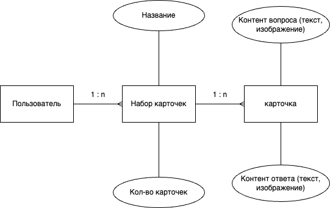
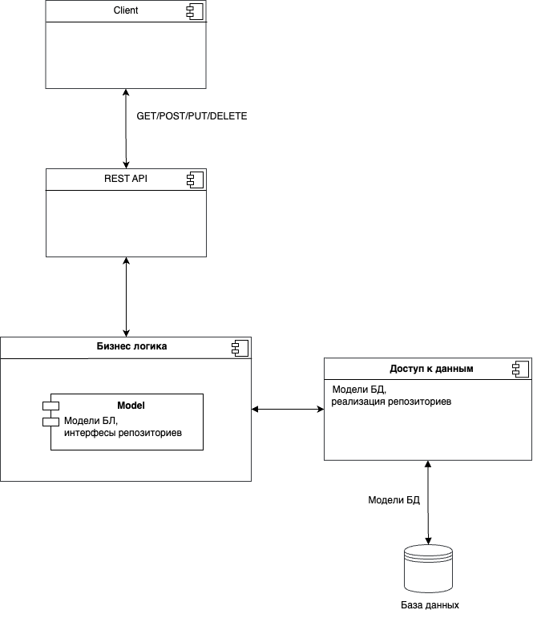
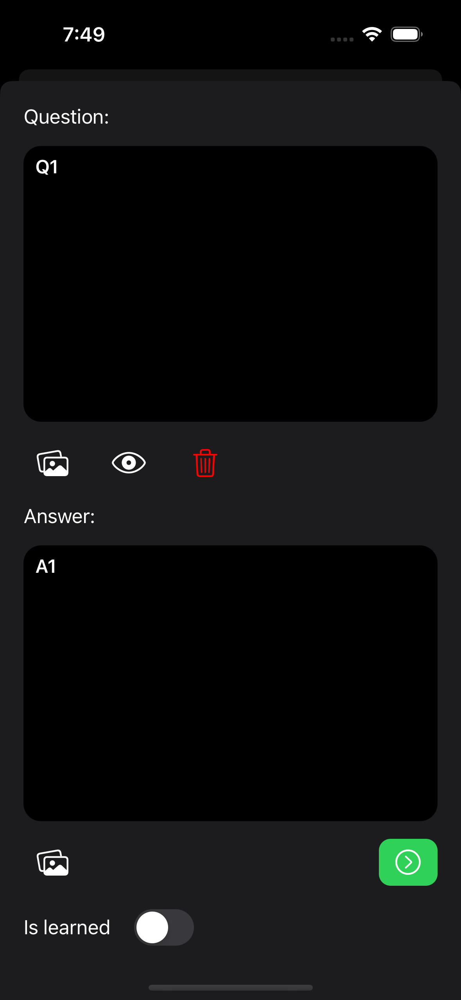

# 1. Cards

2. Приложение Cards позволит ускорить процесс заучивания новой информации. Пользователь может создавать наборы карточек для заучивания. Каждая карточка имеет две стороны - с вопросом и ответом. 

3. Предметная область данного проекта - образование.

4. Критерии анализа аналогичных решений:
   1. Наличие веб-версии сервиса (Критерий 1);
   2. Возможность работы в автономном режиме (Критерий 2);
   3. Возможность добавлять в вопросы/ответы картинки бесплатно (Критерий 3);

​	Аналогичные решения:

1. «Anki»
2. «Quizlet»

​	Таблица сравнения

|            | «Anki» | «Quizlet» | Cards |
| ---------- | ------ | --------- | ----- |
| Критерий 1 | нет    | да        | нет   |
| Критерий 2 | да     | да        | да    |
| Критерий 3 | нет    | нет       | да    |

5. Данный проект позволит удобно создавать и заучивать информацию в форме карточек, при этом весь необходимый функционал предоставляется бесплатно (прежде всего возможность размещения графической информации на карточках). 

6. Пользовательские сценарии
   1. По нажатию кнопки "+" предлагается ввести наименование нового набора карточек и далее перейти в режим добавления карточек для набора
   2. В режиме создания карточек пользоатель сначала заполняет сторону вопроса (вводит текст, добавляет изображения), а затем сторону ответа
   3. Пользователь имеет таблицу с названиями наборов карточек и может выбрать один из них для просмотра/редактирования/удаления
   4. В режиме заучивания пользователь сначала просматривает вопрос карточки, пытается вспомнить ответ и затем проверяет себя (по нажатию на карточку показывается ответ)
   5. В зависимости от правильности ответа, пользователь помечает карточку как заученную или незаученную. После этого карточка автоматически добавляется в соответсвющий набор (заученных или незаученных соответственно)
   6. Пользователь может перемешать карточки в наборе
   7. Пользователь может активировать "подмешивание" выученных карточек в набор невыученных с настраивавемой "интенсивностью"
   8. Пользователь может переместить все карточки из заученного набора в незаученный, напрмер, для повторения
7. Формализация бизнес-правил

# Проектирование

1. Цель: приложение Cards позволит ускорить процесс заучивания новой информации. Пользователь может создавать наборы карточек для заучивания. Каждая карточка имеет две стороны - с вопросом и ответом. 

2. Краткий перечень функциональных требований:
 - создание/удаление/изменение набора карточек 
 - создание/удаление/изменение карточки в наборе
 - пометка карточки как выученной/невыученной
 - перемешивание карточек в наборе  
 - подмешивание выученных карточек в невыученные

3. Use-Case - диаграмма

4. Формализация бизнес-правил

5. Пользовательские сценарии
   1. По нажатию кнопки "+" предлагается ввести наименование нового набора карточек и далее перейти в режим добавления карточек для набора
   2. В режиме создания карточек пользоатель сначала заполняет сторону вопроса (вводит текст, добавляет изображения), а затем сторону ответа
   3. Пользователь имеет таблицу с названиями наборов карточек и может выбрать один из них для просмотра/редактирования/удаления
   4. В режиме заучивания пользователь сначала просматривает вопрос карточки, пытается вспомнить ответ и затем проверяет себя (по нажатию на карточку показывается ответ)
   5. В зависимости от правильности ответа, пользователь помечает карточку как заученную или незаученную. После этого карточка автоматически добавляется в соответсвющий набор (заученных или незаученных соответственно)
   6. Пользователь может перемешать карточки в наборе
   7. Пользователь может активировать "подмешивание" выученных карточек в набор невыученных с настраивавемой "интенсивностью"
   8. Пользователь может переместить все карточки из заученного набора в незаученный, напрмер, для повторения

6. ER-диаграмма сущностей

7. Диаграма БД

8. Диаграма компонентов

9. Инструменты разработки
- Язык: Swift
- Интерфейс: UIKit
- База данных: CoreData (SQLite) и файловая система
- Тип приложения: Mobile

10. UML диаграмма

11. Экраны 

Список наборов / настройки

  
   

Просмотр карточки / список карточек

  
   

Экран добавления / модификации карточки

  

