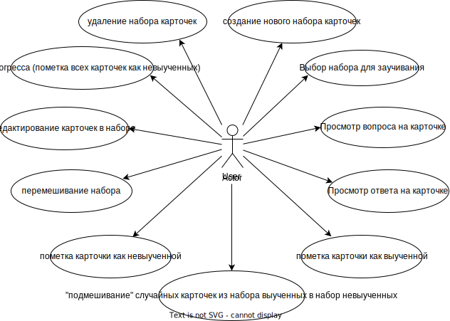
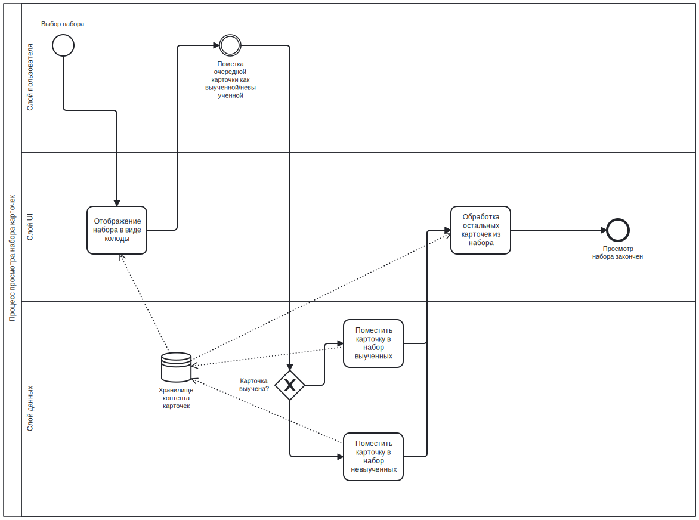
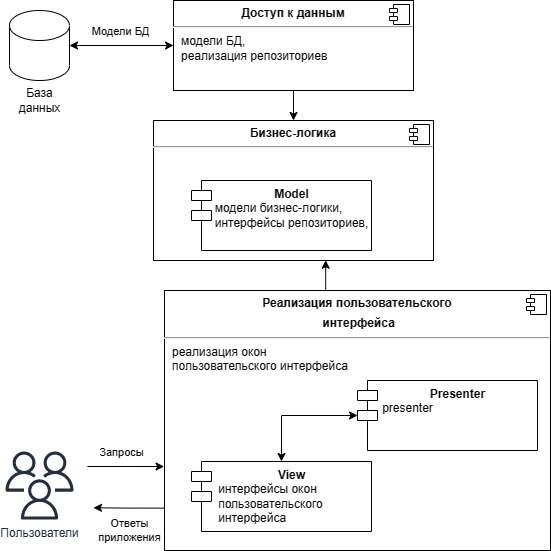
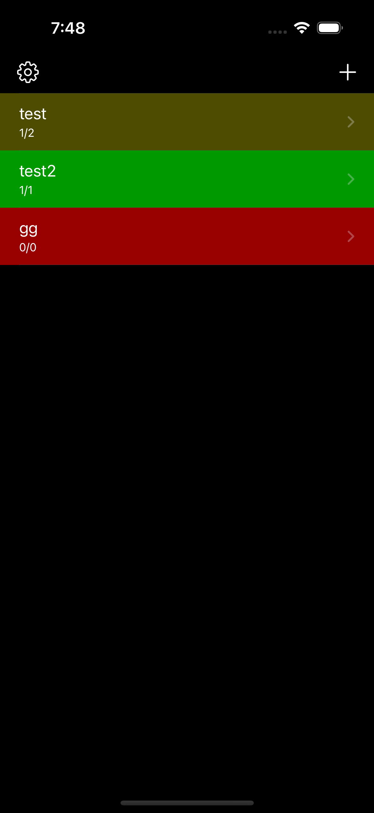
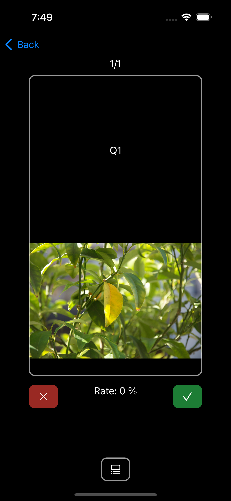
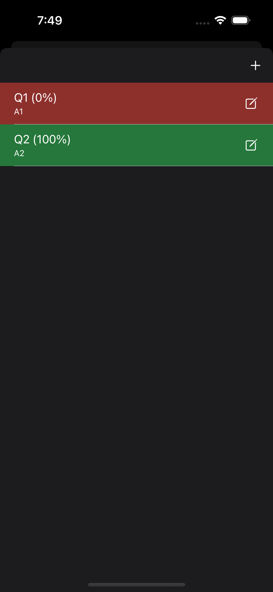

1. Цель: приложение Cards позволит ускорить процесс заучивания новой информации. Пользователь может создавать наборы карточек для заучивания. Каждая карточка имеет две стороны - с вопросом и ответом. 

2. Краткий перечень функциональных требований:
 - создание/удаление/изменение набора карточек 
 - создание/удаление/изменение карточки в наборе
 - пометка карточки как выученной/невыученной
 - перемешивание карточек в наборе  
 - подмешивание выученных карточек в невыученные

3. Use-Case - диаграмма

4. Формализация бизнес-правил

5. Пользовательские сценарии
   1. По нажатию кнопки "+" предлагается ввести наименование нового набора карточек и далее перейти в режим добавления карточек для набора
   2. В режиме создания карточек пользоатель сначала заполняет сторону вопроса (вводит текст, добавляет изображения), а затем сторону ответа
   3. Пользователь имеет таблицу с названиями наборов карточек и может выбрать один из них для просмотра/редактирования/удаления
   4. В режиме заучивания пользователь сначала просматривает вопрос карточки, пытается вспомнить ответ и затем проверяет себя (по нажатию на карточку показывается ответ)
   5. В зависимости от правильности ответа, пользователь помечает карточку как заученную или незаученную. После этого карточка автоматически добавляется в соответсвющий набор (заученных или незаученных соответственно)
   6. Пользователь может перемешать карточки в наборе
   7. Пользователь может активировать "подмешивание" выученных карточек в набор невыученных с настраивавемой "интенсивностью"
   8. Пользователь может переместить все карточки из заученного набора в незаученный, напрмер, для повторения

6. ER-диаграмма сущностей

7. Диаграма БД

8. Диаграма компонентов

9. Экраны 

Список наборов / настройки

  
   

Просмотр карточки / список карточек

  
   

Экран добавления / модификации карточки

  

